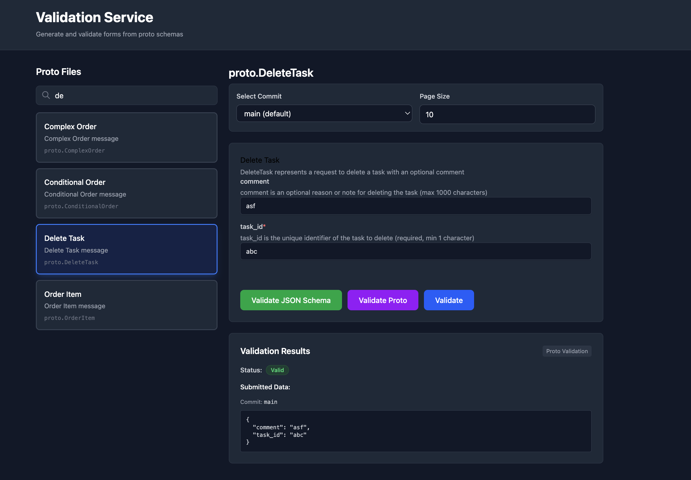
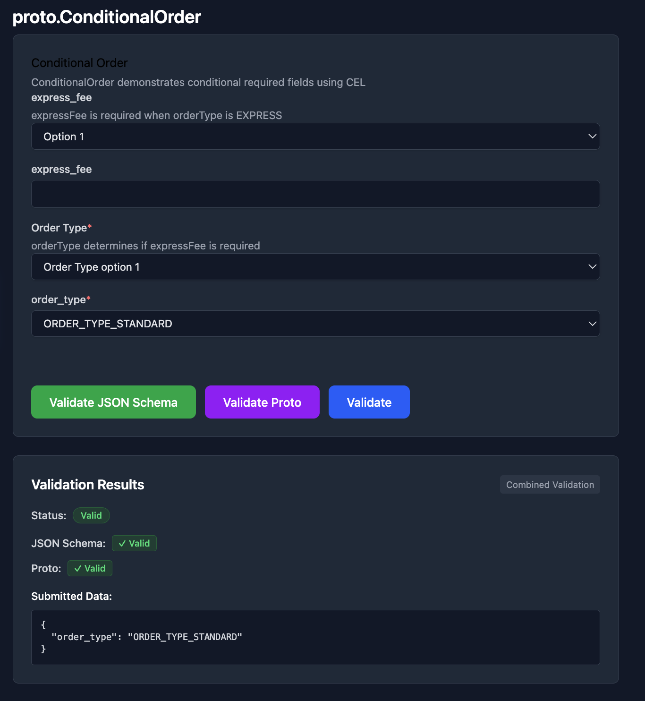
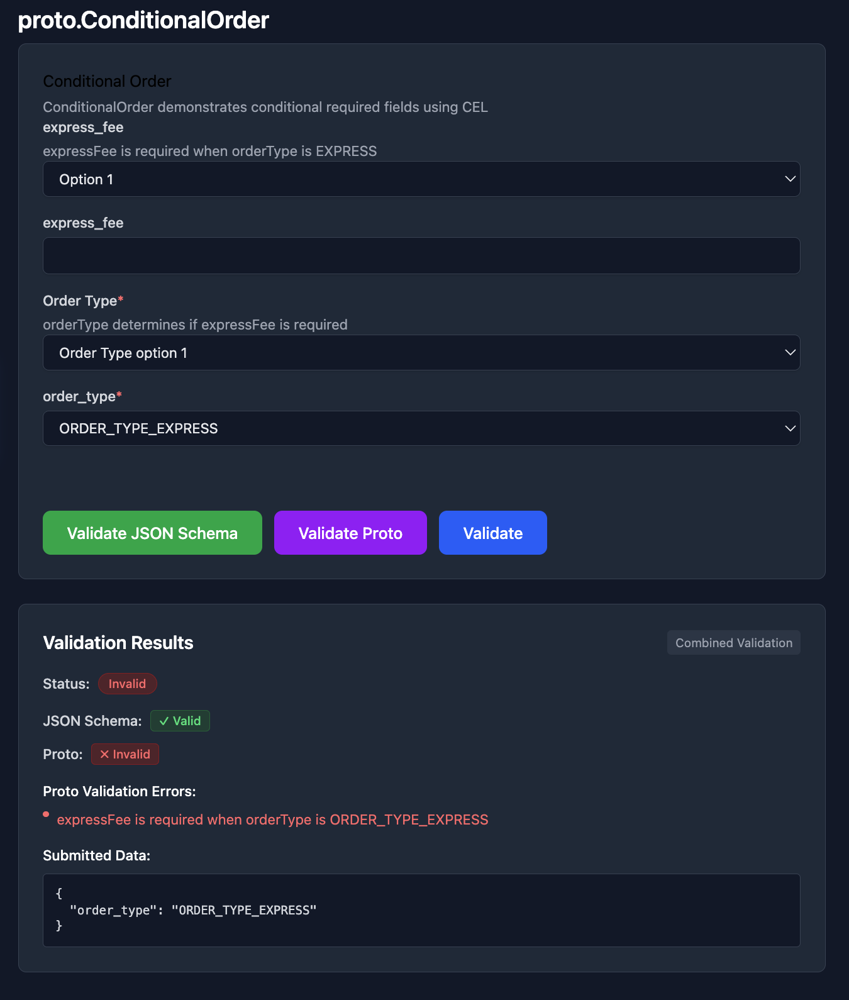

# Validation Service

## 1. Validation POC

This project is a proof of concept to validate and demonstrate how the following technologies work together:

- **protovalidate**: A Protocol Buffer validation library that provides runtime validation for protobuf messages using constraint annotations
- **proto to JSON schema**: Conversion of Protocol Buffer files to JSON Schema format, enabling schema-driven validation in web applications
- **Integration**: How protovalidate constraints in proto files are converted to JSON Schema validation rules and validated both on the backend (using protovalidate) and frontend (using JSON Schema)

The backend uses protovalidate for server-side validation and generates JSON Schema files from proto files using buf's protoschema-jsonschema plugin. The frontend consumes these JSON schemas to provide client-side validation forms and displays validation results from both JSON Schema validation and protovalidate validation.

## 2. Requirements

Before setting up the project, ensure you have the following installed:

- **Go**: Version 1.25.5 or later
  - Download from: https://go.dev/dl/
  
- **ReactJS**: Version 19.2.0 or later
  - Node.js and npm are required for React
  - Download from: https://nodejs.org/

- **buf CLI**: Required for Protocol Buffer code generation and registry operations
  - Installation: https://buf.build/docs/installation
  - Verify installation: `buf --version`

- **buf Schema Registry Account**: Required for pushing and pulling proto files
  - Create an account at: https://buf.build/
  - Current configuration: `buf.build/sanjeev-personal/validation` (configured in `backend/buf.yaml`)

## 3. Setup

### buf Registry Configuration

1. Ensure buf CLI is installed:
   ```bash
   buf --version
   ```

2. Authenticate with buf Schema Registry:
   ```bash
   buf login
   ```

3. Verify `backend/buf.yaml` has the correct module name for your buf registry account:
   ```yaml
   modules:
     - path: .
       name: buf.build/YOUR_ORG/YOUR_MODULE
   ```
   Currently configured as: `buf.build/sanjeev-personal/validation`

### Environment Variable Configuration

The backend supports configuration through environment variables. Create a `.env` file in the `backend/` directory (you can use `backend/.env.example` as a template):

1. Copy the example file:
   ```bash
   cd backend
   cp .env.example .env
   ```

2. Configure the following variables in `.env`:

   - **`BUF_TOKEN`**: Your Buf Schema Registry authentication token (required for accessing private BSR repositories)
     - Get your token from: https://buf.build/settings/user
   
   - **`LOG_LEVEL`**: Logging level (default: `INFO`)
     - Options: `DEBUG`, `INFO`, `WARN`, `ERROR`
   
   - **`SCHEMA_SOURCE_MODE`**: Strategy for retrieving JSON schemas (default: `local-then-bsr`)
     - `local-then-bsr`: Check local files first, then fall back to BSR if not found
     - `bsr-only`: Skip local file check and fetch directly from BSR
     - `local-only`: Only use local files, never fetch from BSR
   
   - **`VALIDATION_SOURCE_MODE`**: Strategy for retrieving proto descriptors for validation (default: `bsr-only`)
     - `bsr-only`: Fetch proto descriptors directly from BSR
     - `local-only`: Only use local proto files
     - `local-then-bsr`: Check local files first, then fall back to BSR

**Note**: If the `.env` file doesn't exist, the application will use system environment variables or default values.

### API Server Configuration

The frontend API base URL is configured in `frontend/src/services/api.ts` as:
```typescript
const API_BASE_URL = 'http://localhost:8080/api';
```

Ensure this matches your backend HTTP server port configuration.

### Port Matching

- **Backend HTTP server**: Port `8080` (configured in `backend/main.go`)
- **Backend gRPC server**: Port `50051` (configured in `backend/main.go`)
- **Frontend dev server**: Port `5173` (Vite default, or next available port)

Make sure ports `8080` and `5173` are available and not in use by other applications.

## 4. Usage

### Running the Backend

1. Navigate to the backend directory:
   ```bash
   cd backend
   ```

2. Install Go dependencies (first time only):
   ```bash
   go mod download
   ```

3. Run the server:
   ```bash
   make run
   ```
   Or directly:
   ```bash
   go run main.go
   ```

The server will start on:
- HTTP server: `http://localhost:8080`
- gRPC server: `localhost:50051`

### Running the Frontend

1. Navigate to the frontend directory:
   ```bash
   cd frontend
   ```

2. Install dependencies (first time only):
   ```bash
   npm install
   ```

3. Start the development server:
   ```bash
   npm run dev
   ```

The frontend will be available at `http://localhost:5173` (or the next available port if 5173 is in use).

### Make Commands

Available make commands in the `backend/` directory:

- **`make install-deps`**: Check for buf CLI installation
- **`make proto`**: Generate Go code from .proto files using buf (also generates JSON Schema files in `gen/jsonschema/`)
- **`make push`**: Push proto files to buf registry
- **`make run`**: Run the gRPC and HTTP server
- **`make clean`**: Remove generated files (`proto/*.pb.go` and `gen/jsonschema/`)
- **`make help`**: Show all available commands

## 5. Workflow

Follow these steps to work with the validation service:

### a) Create your proto file

Add or modify `.proto` files in the `backend/proto/` directory. You can add protovalidate constraints using annotations:

```protobuf
syntax = "proto3";

import "buf/validate/validate.proto";

message User {
  string name = 1 [(validate.rules).string.min_len = 1];
  int32 age = 2 [(validate.rules).int32.gt = 0];
}
```

### b) make proto

Run the proto generation command in the `backend/` directory:

```bash
cd backend
make proto
```

This command will:
- Generate Go code from proto files (`.pb.go` files in `proto/` directory)
- Generate JSON Schema files from proto files with protovalidate constraints (in `gen/jsonschema/` directory)

**Important**: Always run `make proto` after modifying `.proto` files to regenerate the code and schemas.

### c) run server

Start both the backend and frontend servers:

**Terminal 1 - Backend:**
```bash
cd backend
make run
```

**Terminal 2 - Frontend:**
```bash
cd frontend
npm run dev
```

### d) check frontend validations

1. Open the frontend in your browser: `http://localhost:5173`

2. Select a proto file from the dropdown list (the list is populated from proto files available in the backend)

3. The form will automatically load the JSON Schema for the selected proto message type

4. **Commit History (Optional)**: 
   - The frontend can fetch commit history from the Buf registry
   - Select a commit from the dropdown to validate against a specific version of the proto schema
   - Adjust the page size to control how many commits are fetched
   - By default, validation uses the `main` branch/commit

5. Fill in the form fields with test data, including values that violate validation constraints (e.g., empty strings, negative numbers, etc.)

6. Submit the form to see validation results:
   - **JSON Schema validation**: Client-side validation using the generated JSON Schema
   - **protovalidate validation**: Server-side validation using protovalidate library (validates against the selected commit if specified)
   - Both validation results are displayed, showing friendly error messages and technical details

This workflow demonstrates how protovalidate constraints in proto files are converted to JSON Schema rules and validated at both the client and server levels. The commit history feature allows you to validate against specific versions of your proto schemas stored in the Buf registry.

## 6. Features

### Commit History Integration

The service supports fetching and validating against specific commits from the Buf Schema Registry:

- **Commit History API**: `GET /api/v1/commits?label=main&pageSize=10&pageToken=...`
  - Fetches commit history for a specific label (default: `main`)
  - Supports pagination with `pageSize` and `pageToken` parameters
  - Returns commit information including commit ID, creation time, and digest

- **Commit-Based Validation**: When validating proto messages, you can specify a commit ID to validate against a specific version of the schema stored in BSR
  - The validation service fetches the FileDescriptorSet from BSR for the specified commit
  - This enables validating against historical versions of your proto schemas
  - Defaults to `main` branch if no commit is specified

**Commit History UI Example:**
The frontend provides a user-friendly interface for selecting commits and validating proto messages. You can select a commit from the dropdown, adjust the page size for commit retrieval, and validate forms against specific schema versions.



### Schema Source Modes

The service supports flexible schema retrieval strategies:

- **Local-Then-BSR**: Checks local files first, falls back to BSR if not found (default for schemas)
- **BSR-Only**: Always fetches from Buf Schema Registry, useful for production environments
- **Local-Only**: Only uses local files, useful for offline development

These modes can be configured separately for schema retrieval and validation descriptor retrieval via environment variables.

## 7. Examples

### Conditional Order Validation

The `ConditionalOrder` message demonstrates conditional required fields using CEL (Common Expression Language) constraints. The `express_fee` field is required only when `order_type` is `ORDER_TYPE_EXPRESS`.

**Validation Pass Example:**
When an express order includes the required `express_fee` field, validation passes successfully.



**Validation Fail Example:**
When an express order is submitted without the required `express_fee` field, validation fails with a CEL constraint error.



### Available Proto Messages

The service includes various proto message types for validation examples:

- **Task Management**: `proto.Task`, `proto.UpdateTask`, `proto.DeleteTask`
- **Order Processing**: `proto.ConditionalOrder`, `proto.ComplexOrder`, `proto.OrderItem`
- **Product Management**: `proto.Product`, `proto.AgeRestrictedProduct`, `proto.InventoryItem`
- **Customer Information**: `proto.CustomerInfo`, `proto.PersonalInfo`, `proto.ContactInfo`, `proto.EmergencyContact`
- **Payment & Shipping**: `proto.PaymentInfo`, `proto.ShippingInfo`, `proto.DiscountCoupon`
- **Employee & Warehouse**: `proto.EmployeeProfile`, `proto.WorkInfo`, `proto.Warehouse`
- **Utility Types**: `proto.SimpleUser`, `proto.NumericTypes`, `proto.DateRange`, `proto.StatusMessage`, `proto.ProductList`

Each proto message includes validation rules defined using protovalidate constraints, which are automatically converted to JSON Schema validation rules for frontend validation.
